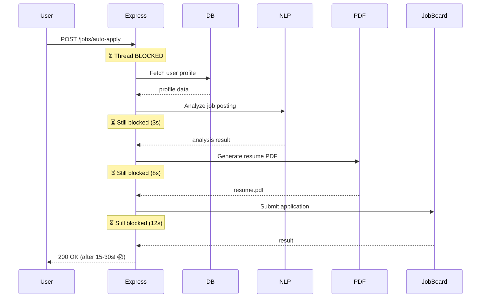
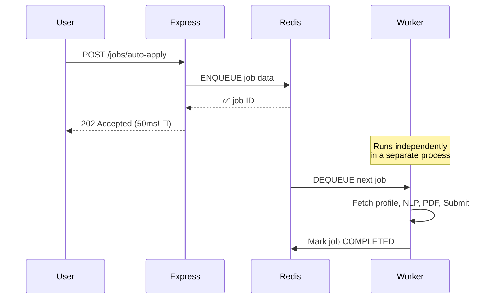
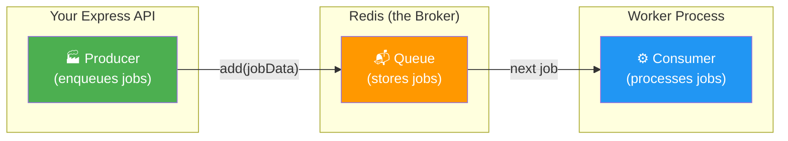
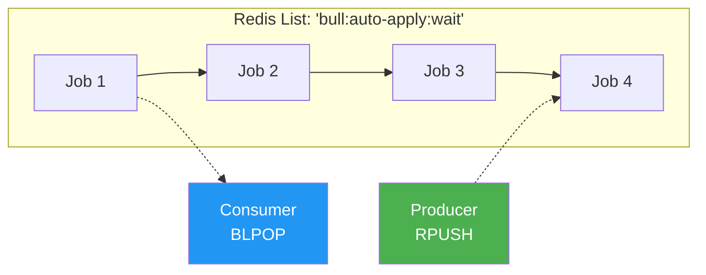
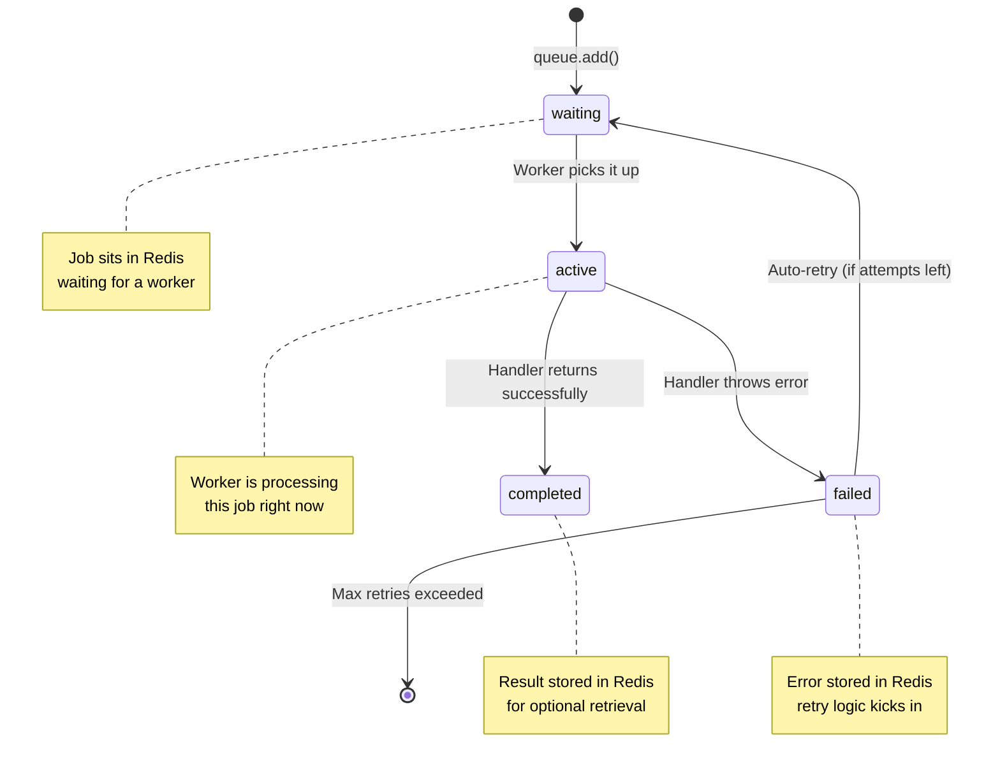
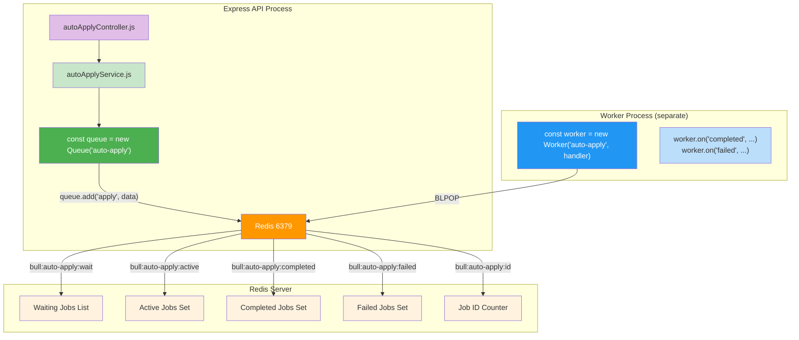
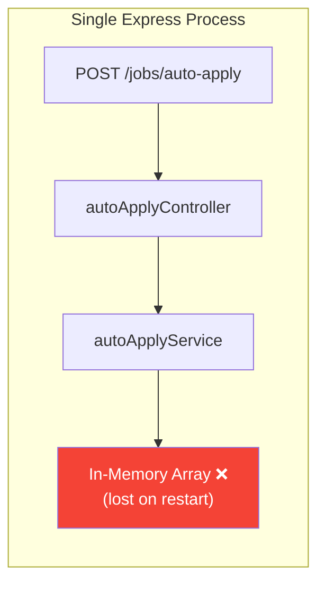
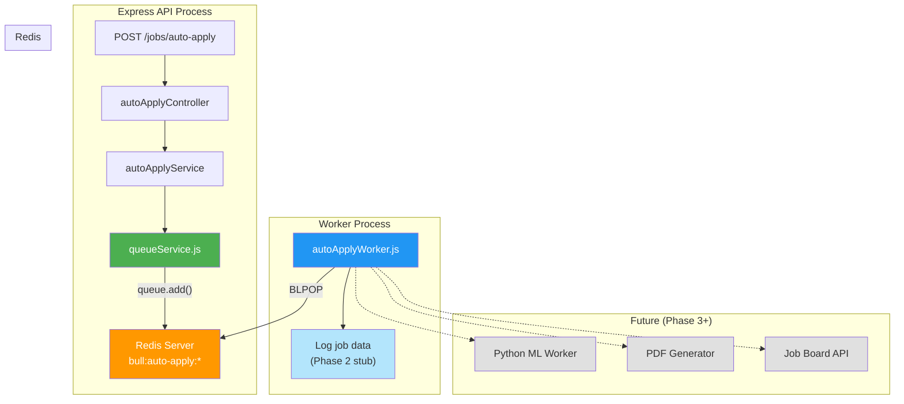

# Job Queue Internals — From Scratch to Hustle.ai

This guide teaches you **everything you need to know** before touching a single line of implementation code. We'll go from first principles → Redis internals → BullMQ architecture → your exact Hustle.ai mapping.

---

## 1. The Problem: Why Can't We Just Use `await`?

Here's what your current [autoApplyService.js](file:///e:/Study/Main-Content/Major%20Projects/Hustle.ai/backend/src/services/autoApplyService.js) does:

```js
// Current: Synchronous, in-memory stub
this.jobs.push({ ...jobData, enqueuedAt: new Date() });
```

When the user hits `POST /jobs/auto-apply`, think about what *actually* needs to happen in production:

1. Fetch the user's profile + resume from the database
2. Call an NLP microservice to analyze the job posting
3. Generate a tailored resume (PDF — CPU-heavy, 5-10 seconds)
4. Generate a cover letter (another PDF)
5. Submit the application to the external job board API (network call, could be slow/fail)

> [!CAUTION]
> If you do all of this inside [autoApply](file:///e:/Study/Main-Content/Major%20Projects/Hustle.ai/backend/src/controllers/autoApplyController.js#4-14) controller synchronously, the HTTP response takes **15-30 seconds**. Meanwhile, that Express worker thread is **blocked** — it can't serve any other requests. With 100 concurrent users, your server is dead.

### The Synchronous Nightmare



### The Queue Solution



**Key insight:** The API responds in **milliseconds**. The heavy work happens **asynchronously** in a separate worker process. The user doesn't wait.

---

## 2. Core Concepts: The Producer-Broker-Consumer Pattern

Every message queue in the world follows this 3-part pattern:



| Role | In Hustle.ai | What it does |
|------|--------------|--------------|
| **Producer** | [autoApplyService.js](file:///e:/Study/Main-Content/Major%20Projects/Hustle.ai/backend/src/services/autoApplyService.js) | Takes user request → pushes job data into the queue |
| **Broker** | Redis (via BullMQ) | Stores the job, manages ordering, handles retries |
| **Consumer** | Worker process (new file) | Pulls jobs from the queue → does the heavy processing |

> [!IMPORTANT]
> The Producer and Consumer are **different processes**. They don't share memory. They communicate **only through the broker (Redis)**. This is what makes the pattern scalable — you can run 10 workers on 10 different machines.

---

## 3. Redis Internals: The Backbone

### What is Redis?

Redis is an **in-memory data structure store**. Think of it as a super-fast key-value database that lives entirely in RAM. It supports data structures like strings, lists, sets, sorted sets, and hashes — which is what makes it perfect for queues.

### How Redis Implements Queues (under the hood)

At its core, a Redis queue is just a **List** data structure:



Two atomic Redis commands make this work:

| Command | What it does | Who calls it |
|---------|-------------|-------------|
| `RPUSH key value` | Push item to the **right** end (tail) of the list | Producer |
| `BLPOP key timeout` | **Blocking** pop from the **left** end (head) | Consumer |

**BLPOP** is the magic: the consumer says "give me the next item, and if there isn't one, **block** (sleep) until one arrives." This means zero CPU usage when idle — no polling loops, no `setInterval`.

### Redis Persistence

> [!NOTE]
> "But it's in-memory! What if Redis crashes?"
> 
> Redis has two persistence modes:
> - **RDB**: Snapshots the entire dataset to disk every N seconds
> - **AOF** (Append-Only File): Logs every write command, replays on restart
> 
> For job queues, even if you lose a few jobs on a crash, the application can retry. BullMQ adds its own reliability layer on top.

### Why Redis over other options?

| Feature | Redis | PostgreSQL (as queue) | RabbitMQ |
|---------|-------|-----------------------|----------|
| Latency | **~0.1ms** | ~5ms | ~1ms |
| Throughput | **100k+ ops/sec** | ~5k ops/sec | ~30k ops/sec |
| Setup Complexity | **Low** | Already have it | Medium |
| Node.js Library | **BullMQ (excellent)** | pg-boss | amqplib |
| Learning Curve | **Low** | Low | Higher |

**For Hustle.ai:** Redis + BullMQ is the sweet spot. Low complexity, battle-tested in production Node.js apps, and you'll need Redis for caching later anyway.

---

## 4. BullMQ Architecture Deep Dive

BullMQ is a **Node.js library** that wraps Redis with production-grade queue features. Here's what it adds on top of raw Redis lists:

### Job Lifecycle (State Machine)

Every job in BullMQ goes through a well-defined state machine:



### BullMQ Components



### Key BullMQ Concepts

| Concept | What it means | Example |
|---------|--------------|---------|
| **Queue** | A named channel where producers push jobs | `new Queue('auto-apply')` |
| **Worker** | A process that consumes jobs from a queue | `new Worker('auto-apply', processFn)` |
| **Job** | A unit of work with data + metadata | `{ candidateId, jobId, resumeUrl }` |
| **Attempts** | How many times to retry a failed job | `{ attempts: 3 }` |
| **Backoff** | Delay between retries (exponential) | `{ backoff: { type: 'exponential', delay: 1000 } }` |
| **Concurrency** | How many jobs one worker processes at once | `new Worker('q', fn, { concurrency: 5 })` |
| **Events** | Lifecycle hooks for monitoring | `worker.on('completed', ...)` |

### What does the code actually look like?

Here's a mental model of the three pieces:

**Producer side (your Express service):**
```js
const { Queue } = require('bullmq');
const queue = new Queue('auto-apply', { connection: { host: '127.0.0.1', port: 6379 } });

// Enqueue a job
await queue.add('apply-job', {
  userId: 'u123',
  candidateId: 'c456',
  jobId: 'j789',
  resumeUrl: 'https://...'
});
```

**Consumer side (a separate script/process):**
```js
const { Worker } = require('bullmq');

const worker = new Worker('auto-apply', async (job) => {
  console.log(`Processing job ${job.id}`, job.data);
  // In the future: fetch profile, call NLP, generate PDF, submit
  return { status: 'applied' };
}, { connection: { host: '127.0.0.1', port: 6379 } });

worker.on('completed', (job, result) => {
  console.log(`Job ${job.id} completed:`, result);
});

worker.on('failed', (job, err) => {
  console.error(`Job ${job.id} failed:`, err.message);
});
```

---

## 5. How This Maps to Hustle.ai

### Current Architecture (Phase 1 — what you have now)



### Target Architecture (Phase 2 — what we're building)



### Files we'll create/modify

| File | Role | Action |
|------|------|--------|
| `src/config/redis.js` | Redis connection config | **NEW** |
| `src/services/queueService.js` | BullMQ Queue wrapper (Producer) | **NEW** |
| [src/services/autoApplyService.js](file:///e:/Study/Main-Content/Major%20Projects/Hustle.ai/backend/src/services/autoApplyService.js) | Update to use real queue | **MODIFY** |
| `src/workers/autoApplyWorker.js` | Consumer that logs jobs | **NEW** |
| `tests/services/queueService.test.js` | Tests for queue service | **NEW** |

---

## 6. Reliability Guarantees (Why This Matters)

| Problem | In-Memory Array (now) | BullMQ + Redis |
|---------|----------------------|----------------|
| Server restart | **All jobs lost** ❌ | Jobs persist in Redis ✅ |
| Job processing fails | Silent failure | Auto-retry with backoff ✅ |
| Server overloaded | Blocks the event loop | Worker processes independently ✅ |
| Multiple servers | Each has its own array | All share the same Redis ✅ |
| Job tracking | No visibility | Full lifecycle events ✅ |
| Rate limiting | Not possible | Built-in rate limiter ✅ |

---

## 7. Summary: Mental Model Checklist

Before you say "go ahead," make sure you understand:

- [x] **Why queues?** → Decouple slow work from the API response
- [x] **Producer-Broker-Consumer** → Express pushes → Redis stores → Worker processes
- [x] **Redis** → In-memory data store, uses Lists for queues, BLPOP for blocking reads
- [x] **BullMQ** → Node.js library wrapping Redis with job lifecycle management
- [x] **Job States** → waiting → active → completed/failed (with retries)
- [x] **Separate Processes** → API and Worker are different Node.js processes
- [x] **What we're building** → Replace [AutoApplyQueueStub](file:///e:/Study/Main-Content/Major%20Projects/Hustle.ai/backend/src/services/autoApplyService.js#5-18) with real BullMQ, add a logging worker

> [!TIP]
> **The key mental model:** Think of Redis as a "mailbox" between your API and your workers. The API drops mail in (fast), the workers pick it up and do the real work (slow, at their own pace). The mailbox survives restarts and can be read by multiple workers.
