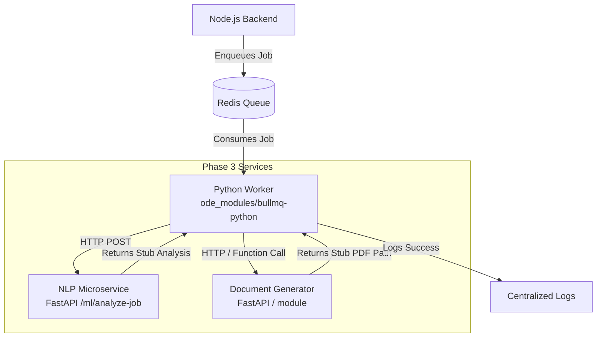
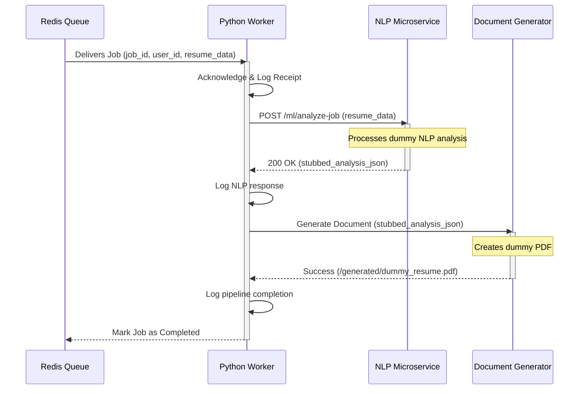

Based on the `Hustle.ai-development-phases.md` document, here is an analysis and detailed plan for **Phase 3: Python Worker & Microservice Bootstrapping**, complete with architecture and sequence diagrams.

### Overview of Phase 3
Phase 3 focuses on transitioning the processing pipeline from the Node.js/TypeScript backend (which enqueues the job in Phase 2) into the Python ecosystem, which is well-suited for ML/NLP and document generation tasks. The goal here is **bootstrapping** and establishing the communication flow rather than building the complete final logic for the ML and document generation steps.

---

### Architecture Diagram

The following diagram illustrates the high-level architecture for Phase 3. It shows how the existing Node.js backend pushes jobs to a Redis queue, which are then consumed by the new Python Worker. The worker then orchestrates calls to the NLP and Document Generator microservices.

---

### Sequence Diagram

This sequence diagram details the step-by-step data flow and orchestration performed by the Python Worker during a single job execution.

---

### Detailed Plan for Phase 3

#### 1. Setup Python Worker Environment
- **Objective:** Establish the foundation for the Python worker application.
- **Tasks:**
  - Create a new directory for the Python worker (e.g., `services/worker`).
  - Initialize a Python virtual environment (using `venv`, `poetry`, or `uv`).
  - Define dependencies in `requirements.txt` or `pyproject.toml` (e.g., `redis`, `httpx`). Since you are using BullMQ on the Node side, using a compatible Python BullMQ library (like `bullmq` for Python) is highly recommended for seamless integration.
  - Set up a basic configuration file to manage environment variables (e.g., Redis URL, API keys).

#### 2. Implement the Job Consumer (Worker)
- **Objective:** Connect to the Redis queue established in Phase 2 and start consuming jobs.
- **Tasks:**
  - Instantiate the queue worker connecting to the Redis instance.
  - Define the job processing function (the "handler").
  - For now, the handler should just read the job data, acknowledge receipt, and log the job details (e.g., `Received job {job_id} for user {user_id}`).
  - Add basic error handling to catch connection issues or malformed job payloads.

#### 3. Scaffold the NLP Microservice
- **Objective:** Create a stubbed API service that will eventually handle resume analysis and NLP tasks.
- **Tasks:**
  - Create a new directory (e.g., `services/nlp-service`).
  - Choose a lightweight framework (FastAPI is recommended over Flask due to built-in async validation and Swagger UI).
  - Set up the application entry point.
  - Create a single POST endpoint: `/ml/analyze-job`.
  - **Stub Implementation:** The endpoint should accept the required payload (e.g., job description, user resume) and return a static, hardcoded JSON response representing the "analysis result" for now.

#### 4. Scaffold the Document Generator Service
- **Objective:** Establish the component that will generate tailored resumes/cover letters.
- **Tasks:**
  - Create a new directory (e.g., `services/document-generator`).
  - *Decision:* This can either be a separate FastAPI microservice or a module imported directly into the Python Worker. Given the phase description ("Scaffold a document generator service"), it might be a separate service or a distinct logical module. Let's treat it as an independent module or service.
  - Create a stubbed function/endpoint that accepts the output from the NLP service and returns a hardcoded "success" message or a dummy file path (e.g., `"/generated/dummy_resume_123.pdf"`).

#### 5. Integrate the Bootstrapped Components in the Worker
- **Objective:** Verify that the worker can talk to the new stubbed services.
- **Tasks:**
  - Update the Python Worker's job processing function to orchestrate the flow.
  - **Step A:** Worker receives the job.
  - **Step B:** Worker makes an HTTP request to the NLP Microservice's `/ml/analyze-job` endpoint (using the `httpx` or `requests` library).
  - **Step C:** Worker logs the stubbed response from the NLP service.
  - **Step D:** Worker calls the Document Generator service/module with the dummy NLP data.
  - **Step E:** Worker logs the final successful completion of the pipeline.
